```python
from __future__ import print_function
```

#Data Visualization

##Plotting Basics

###1: Plotting basics

Plotting is critical to data science, and python has some great tools to make it easy.

The foundation of most plotting in python is the matplotlib module.

Plots are drawn into a figure. We tell matplotlib how to draw the plots, and then it renders them into the figure.

####Instructions

Get familiar with the interface, then hit "Next" to go to the next screen.


```python
import matplotlib.pyplot as plt
%matplotlib inline

# Create plot data.
month = [1,1,2,2,4,5,5,7,8,10,10,11,12]
temperature = [32,15,40,35,50,55,52,80,85,60,57,45,35]

# Create scatter plot.
plt.scatter(month, temperature)

# Show plot.
plt.show()
```


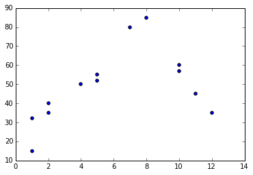


###2: Making a scatter plot

A scatter plot is used to show the relationship between two variables --- in our case, two columns of data.

A scatter plot can show a general trend between two variables, and can help to make sense of messy data.

####Instructions

Create a scatterplot that graphs airline_trip_length on the x-axis, and airline_trip_cost on the y-axis.


```python
import matplotlib.pyplot as plt
%matplotlib inline

# Create plot data.
weight = [600,150,200,300,200,100,125,180]
height = [60,65,73,70,65,58,66,67]

# Create scatter plot.
plt.scatter(weight, height)

# Show plot.
plt.show()

# Create plot data.
airline_trip_length = [100,500,200,800,300,100]
airline_trip_cost = [200,1000,500,3000,1000,300]

# Create scatter plot.
plt.scatter(airline_trip_length, airline_trip_cost)

# Show plot.
plt.show()
```


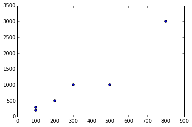


###3: Plotting fire data

Now, that we know how to make scatter plots, let's make a couple that describe our fire data.

####Instructions

Plot the "wind" column on the x axis and the "area" column on the y axis.

Plot the "temp" column on the x axis and the "area" column on the y axis.


```python
import pandas

forest_fires = pandas.read_csv("data/forestfires.csv")
forest_fires.head(5)
```


<div>
<table border="1" class="dataframe">
  <thead>
    <tr style="text-align: right;">
      <th></th>
      <th>X</th>
      <th>Y</th>
      <th>month</th>
      <th>day</th>
      <th>FFMC</th>
      <th>DMC</th>
      <th>DC</th>
      <th>ISI</th>
      <th>temp</th>
      <th>RH</th>
      <th>wind</th>
      <th>rain</th>
      <th>area</th>
    </tr>
  </thead>
  <tbody>
    <tr>
      <th>0</th>
      <td>7</td>
      <td>5</td>
      <td>mar</td>
      <td>fri</td>
      <td>86.2</td>
      <td>26.2</td>
      <td>94.3</td>
      <td>5.1</td>
      <td>8.2</td>
      <td>51</td>
      <td>6.7</td>
      <td>0.0</td>
      <td>0</td>
    </tr>
    <tr>
      <th>1</th>
      <td>7</td>
      <td>4</td>
      <td>oct</td>
      <td>tue</td>
      <td>90.6</td>
      <td>35.4</td>
      <td>669.1</td>
      <td>6.7</td>
      <td>18.0</td>
      <td>33</td>
      <td>0.9</td>
      <td>0.0</td>
      <td>0</td>
    </tr>
    <tr>
      <th>2</th>
      <td>7</td>
      <td>4</td>
      <td>oct</td>
      <td>sat</td>
      <td>90.6</td>
      <td>43.7</td>
      <td>686.9</td>
      <td>6.7</td>
      <td>14.6</td>
      <td>33</td>
      <td>1.3</td>
      <td>0.0</td>
      <td>0</td>
    </tr>
    <tr>
      <th>3</th>
      <td>8</td>
      <td>6</td>
      <td>mar</td>
      <td>fri</td>
      <td>91.7</td>
      <td>33.3</td>
      <td>77.5</td>
      <td>9.0</td>
      <td>8.3</td>
      <td>97</td>
      <td>4.0</td>
      <td>0.2</td>
      <td>0</td>
    </tr>
    <tr>
      <th>4</th>
      <td>8</td>
      <td>6</td>
      <td>mar</td>
      <td>sun</td>
      <td>89.3</td>
      <td>51.3</td>
      <td>102.2</td>
      <td>9.6</td>
      <td>11.4</td>
      <td>99</td>
      <td>1.8</td>
      <td>0.0</td>
      <td>0</td>
    </tr>
  </tbody>
</table>
</div>


```python
import matplotlib.pyplot as plt
%matplotlib inline

plt.scatter(forest_fires["X"], forest_fires["Y"])
plt.show()

plt.scatter(forest_fires["wind"], forest_fires["area"])
plt.show()

plt.scatter(forest_fires["temp"], forest_fires["area"])
plt.show()
```


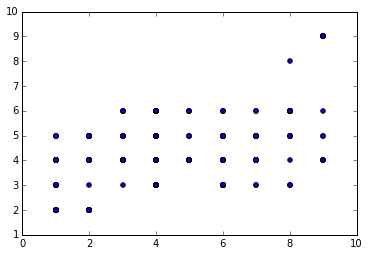


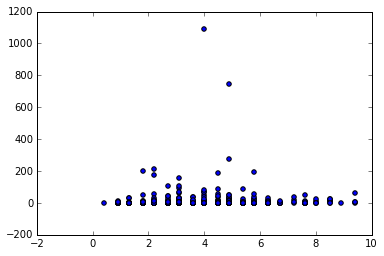


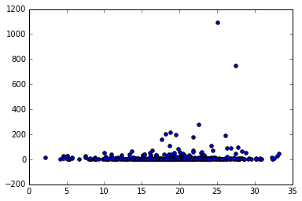


###4: Making a line chart

Another type of chart is a line chart.

This is similar to a scatter plot, but the points are connected into a line.

This generally makes sense for trends and other data that have a clear direction.

####Instructions

Plot "rain" on the x axis and "area" on the y axis.

Plot "wind" on the x axis and "area" on the y axis.

Remember to sort on the x-axis values first!


```python
import matplotlib.pyplot as plt
%matplotlib inline

plt.plot(forest_fires["temp"], forest_fires["area"])
plt.show()

forest_fires = forest_fires.sort(["temp"])
plt.plot(forest_fires["temp"], forest_fires["area"])
plt.show()

forest_fires = forest_fires.sort(["rain"])
plt.plot(forest_fires["rain"], forest_fires["area"])
plt.show()

forest_fires = forest_fires.sort(["wind"])
plt.plot(forest_fires["wind"], forest_fires["area"])
plt.show()
```


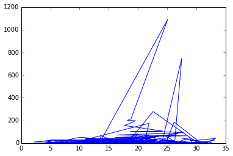


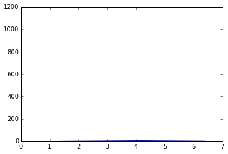


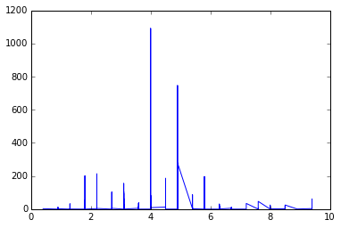


###5: Labeling the chart

Let's add some axis labels and titles to our charts.

####Instructions

Make a scatterplot with the "wind" column on the x axis and the "area" column on the y axis.

Give the chart the title "Wind speed vs fire area", the y axis label "Area consumed by fire", and the x axis label "Wind speed when fire started".


```python
import matplotlib.pyplot as plt
%matplotlib inline

# Scatter plot of "X" and "Y" fire positions.
plt.scatter(forest_fires["X"], forest_fires["Y"])

# Set the x axis label.
plt.xlabel('X position in grid')
# Set the y axis label.
plt.ylabel('Y position in grid')
# Set the title.
plt.title("Grid positions of fires in Montesinho national park")

plt.show()


# Make a scatter plot of "wind" and "area"
plt.scatter(forest_fires["wind"], forest_fires["area"])

# Set the x axis label
plt.xlabel('Wind speed when fire started')
# Set the y axis label
plt.ylabel('Area consumed by fire')
# Set the title
plt.title("Wind speed vs fire area")

plt.show()
```


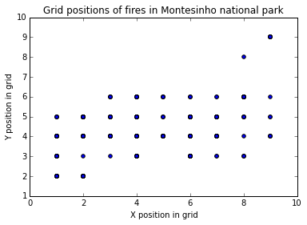


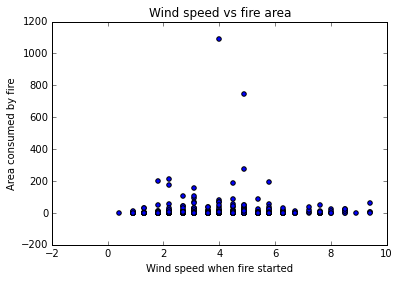


###6: Nicer looking plots

Our plots don't look really great so far.

We'll have to do a couple of things to fix this, but a good first step is to change the global plot style.

Matplotlib has a few styles available, and we can easily switch between them.

####Instructions

Switch to the "fivethirtyeight" style.

Plot "rain" on the x axis and "area" on the y axis.


```python
import matplotlib.pyplot as plt
%matplotlib inline

# Print all available styles.
print("plt.style.available:", plt.style.available)

# Use the ggplot style for plotting.
plt.style.use('ggplot')

# Make a scatter plot of "wind" and "area"
plt.scatter(forest_fires["wind"], forest_fires["area"])

plt.show()

# Use the fivethirtyeight style for plotting.
plt.style.use('fivethirtyeight')

# Make a scatter plot of "rain" and "area"
plt.scatter(forest_fires["rain"], forest_fires["area"])

plt.show()
```

    plt.style.available: ['bmh', 'dark_background', 'grayscale', 'fivethirtyeight', 'ggplot']
    


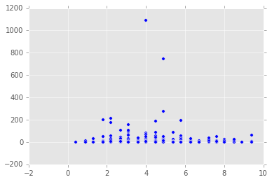


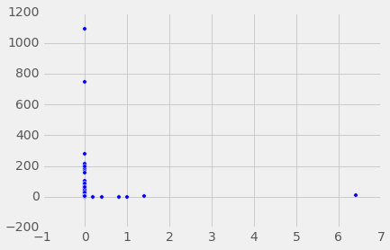


###7: Making a bar plot

The last type of plot we'll look at right now is the bar plot.

Bar plots graph categories and their values against each other.

For example, we can graph month against the area that fires consumed in that month.


```python
import numpy
import matplotlib.pyplot as plt
%matplotlib inline

# Pivot table with Y position of the fire as the index, and the average area of forest burned per fire as the values.
area_by_y = forest_fires.pivot_table(index="Y", values="area", aggfunc=numpy.mean)

# Index values of the vector, in this case, the sorted y positions.
y_index = area_by_y.index
plt.bar(y_index, area_by_y)
plt.show()

# Similar plot for the X positions.
area_by_x = forest_fires.pivot_table(index="X", values="area", aggfunc=numpy.mean)
plt.bar(area_by_x.index, area_by_x)
plt.show()
```


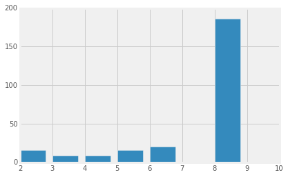


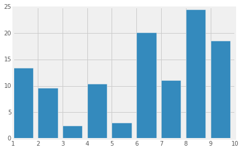

